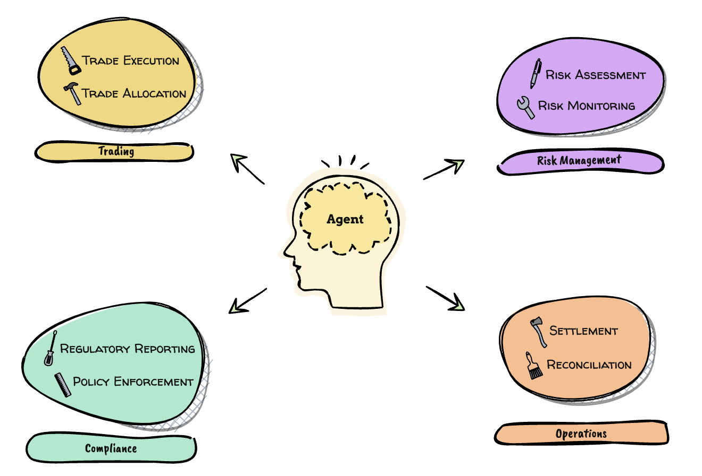
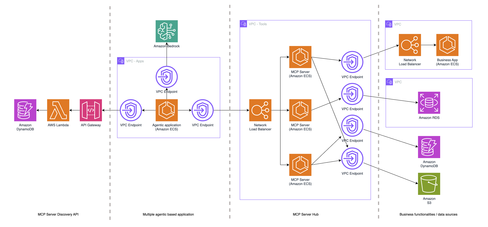
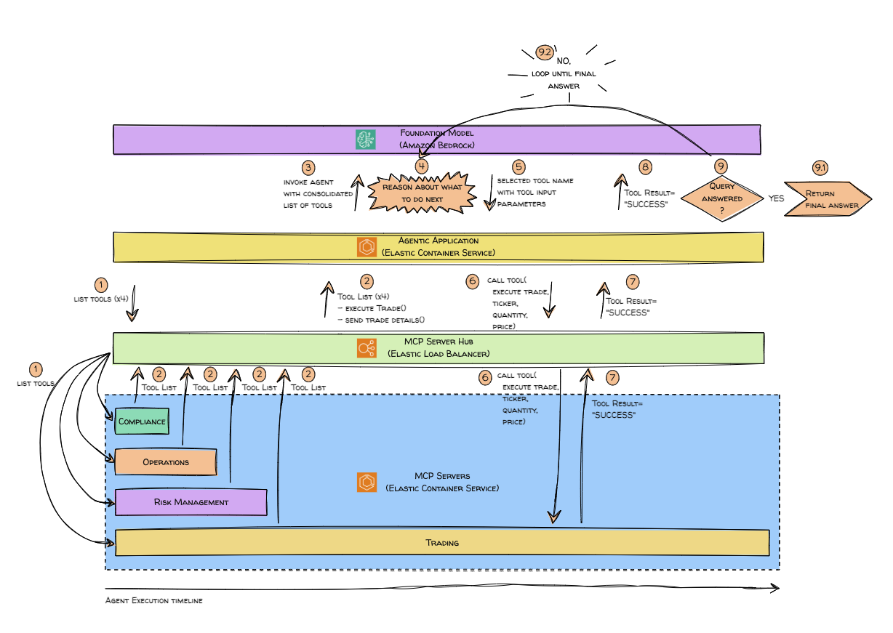
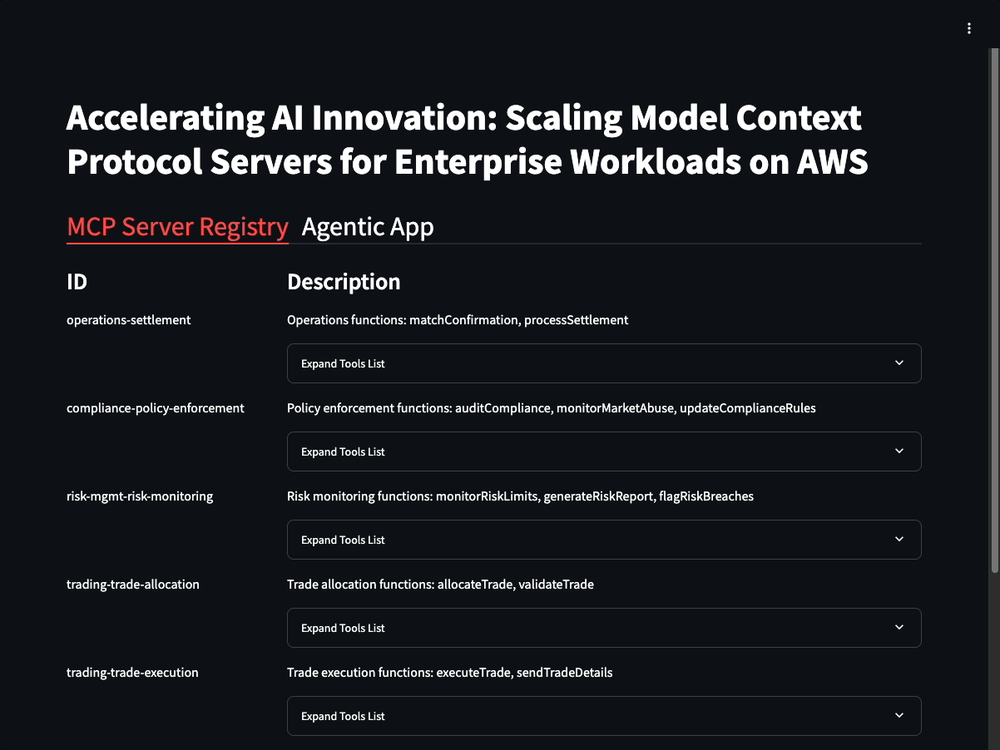
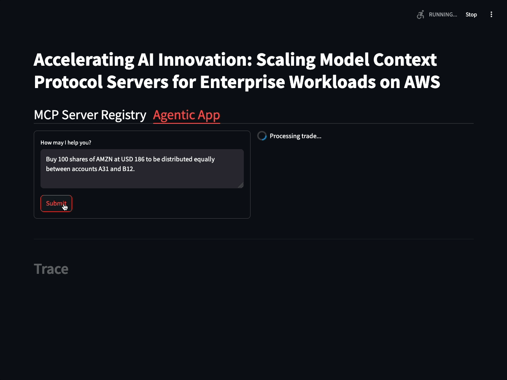

# Accelerating AI Innovation: Scaling Model Context Protocol Servers for Enterprise Workloads on AWS

Generative AI has been moving at a rapid pace with new tools, offerings and model released quite frequently. 2025 has been termed as the year of Generative AI agents and organizations are performing prototypes on how to use Agents in their enterprise environment. Agents depend on tools and every tool may have its own mechanism to send and receive information. Anthropic’s Model Context Protocol (MCP) is an open-source protocol which attempts to solve this challenge. It provides a protocol and communication standard which is cross compatible with tools and can be used to by an Agentic application’s LLM to connect to various tools via a standard mechanism. But, large enterprise organizations like financial service tend to have complex data sharing and operating model which makes it very challenging to implement agents working with MCP.

A major challenge is the siloed approach where individual teams build their own MCP tools, leading to duplication of efforts and wasted resources. This approach slows down innovation and creates inconsistencies in integrations and enterprise design. Furthermore, managing multiple disconnected MCP tools across teams makes it difficult to scale AI initiatives effectively. These inefficiencies hinder enterprises from fully leveraging the potential of generative AI for tasks like post trade processing, customer service automation, and regulatory compliance

<p align="center"></p>

In this repository, we look at a centralized MCP server implementation which offers an innovative approach by providing shared access to tools and resources. This approach allows teams to focus on building AI capabilities rather than spending time developing or maintaining tools. 

This repository is part of a published AWS blog post: to be updated once published.

## Architecture


## How Amazon Bedrock Agent interact with MCP Server
Here is a deep dive on what actually happens when an agent leverages the tools hosted on a MCP server:



Let us walk through the steps show in the diagram:
1.	As a first step, the application connects to the central MCP hub through the load balancer and request for list of available tools from the specific MCP server. This can be fine-grained based on what servers the agentic application has access to. 
2.	In this case, the trade server responds with list of tools available including details such as tool name, description, and required input parameters.
3.	Now, the agentic application invokes Amazon Bedrock Agent and provides the list of tools available.
4.	Using this information, Bedrock Agent reasons about what to do next based on the given task and the list of tools available to it.
5.	Bedrock Agent selects the most suitable tool to use, and responds with the tool name and tool input parameters. The control comes back to the agentic application
6.	Agentic application calls for the execution of the tool through the MCP server using the tool name and tool input parameters.
7.	Trade MCP server executes the tool and returns the results of the execution back to the application.
8.	The application returns the results of the tool execution back to the Amazon Bedrock Agent.
9.	Amazon Bedrock Agent observes the tool execution results and reasons about the next step until it reaches the final answer.


## Deployment Instructions
This repository provides a CDK application that will deploy the entire demo over two VPCs and into your default region.

## AWS services used
- Amazon Bedrock
- Amazon Elastic Container Service (ECS)
- Amazon Elastic Container Repository (ECR)
- Elastic Load Balancer
- Amazon API Gateway
- AWS Lambda
- AWS Secrets Manager
- Amazon Virtual Private Cloud (VPC)
- AWS Privatelink
- AWS Identity and Access Management

## Pre-requisites
- Amazon Bedrock - You will need access to Anthropic Claude v3.5 Haiku.  To setup model access in Amazon Bedrock, [read this](https://docs.aws.amazon.com/bedrock/latest/userguide/model-access.html).
- Python - You will require Python 3.12 and above.
- Docker - You will require v24.0.0 and above with Docker Buildx, and have the docker daemon running.

## Deploy
Run the following command to install the necessary python libraries and deploy the solution.
```
$ ./deploy.sh
```

## Hands on
1.	Once the deployment has completed, access the Streamlit application.
    - You can find the *Streamlit URL* by going to [CloudFormation](https://console.aws.amazon.com/cloudformation/home), selecting the deployed stack name, and going to the *Outputs* tab.   The URL would be available under *StreamlitNLBURL*.
1.  The 1st tab shows the list of MCP servers (& their corresponding tools) available on the MCP Server Registry.  You may expand the tools list on each listed MCP server to view the tools it supports and its required input parameters.
    <p align="center"></p>
1.  The 2nd tab shows a sample agentic application that will make use of the tools available in the MCP Server Hub.<p align="center"></p>
    a. Click on the “Submit” button to invoke an Amazon Bedrock Agent processing flow with the sample request.    
    b. View the Trace output to see the tools that have been executed in order to fulfil the request. For each tool that the agent used, you can view the values of the input parameters, and then the corresponding results.


## Clean up
To destroy the solution:
```
$ ./destroy.sh
```


